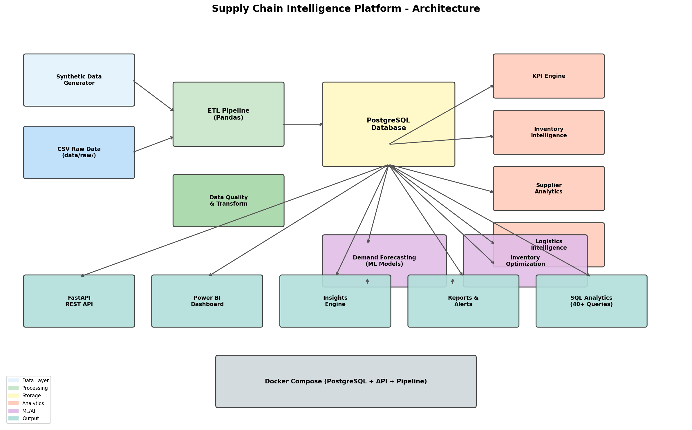

# Supply Chain Intelligence & Demand Forecasting Platform

A production-grade supply chain analytics platform simulating enterprise systems used by Amazon, Walmart, Flipkart, and Target. Built for **Data Analyst**, **Business Analyst**, **Analytics Engineer**, and **Supply Chain Analytics** portfolio showcase.

[](https://python.org)
[](https://fastapi.tiangolo.com)
[](https://postgresql.org)
[](https://docker.com)

## Overview

This platform provides end-to-end supply chain intelligence:

- **ETL Pipeline** — Extract, transform, load with data quality checks
- **KPI Engine** — 20+ enterprise metrics across inventory, supplier, logistics, and service
- **SQL Analytics** — 45 advanced queries with window functions, CTEs, and cohort analysis
- **Demand Forecasting** — Linear Regression, Random Forest, XGBoost, and Prophet models
- **Inventory Optimization** — EOQ, safety stock, and reorder recommendations
- **Automated Insights** — Business recommendations with severity scoring
- **REST API** — FastAPI with OpenAPI documentation
- **Power BI Dashboard** — Complete dashboard specifications with DAX measures

## Dataset Scale

| Entity | Count |
|--------|-------|
| Products | 10,000+ |
| Suppliers | 120+ |
| Warehouses | 25+ |
| Orders | 520,000+ |
| Logistics Records | 440,000+ |

## Architecture



```
Data Generator → ETL Pipeline → PostgreSQL → Analytics Modules → API / Dashboards
                                    ↓
                              ML Forecasting → Inventory Optimization → Insights Engine
```

## Tech Stack

| Layer | Technology |
|-------|-----------|
| Backend | Python, FastAPI |
| Database | PostgreSQL 16 |
| Data Processing | Pandas, NumPy |
| Machine Learning | Scikit-learn, XGBoost, Prophet |
| Visualization | Power BI, Plotly, Matplotlib |
| Deployment | Docker, Docker Compose |
| Testing | Pytest |

## Project Structure

```
├── api/                    # FastAPI REST API
├── dashboards/             # Power BI specifications
├── data/                   # Raw and processed data (generated)
├── models/                 # Trained ML models and metrics
├── notebooks/              # Jupyter exploration notebooks
├── reports/                # Executive reports, resume bullets
├── scripts/                # Pipeline runner, diagram generator
├── sql/
│   ├── schema.sql          # PostgreSQL schema with indexes & views
│   └── queries/            # 45 SQL analytics queries
├── src/
│   ├── etl.py              # ETL pipeline
│   ├── kpi_engine.py       # KPI calculation engine
│   ├── inventory_analysis.py
│   ├── supplier_analysis.py
│   ├── logistics_analysis.py
│   ├── forecasting.py      # Multi-model demand forecasting
│   ├── inventory_optimization.py
│   ├── insights_engine.py  # Automated business insights
│   ├── reporting.py
│   └── data_generator.py   # Synthetic data generator
├── tests/                  # Unit tests
├── docker-compose.yml
├── Dockerfile
├── requirements.txt
├── architecture_diagram.png
└── presentation.pptx
```

## Quick Start

### Prerequisites

- Python 3.11+
- Docker & Docker Compose
- Git

### 1. Clone and Setup

```bash
git clone https://github.com/srimaan07/Supply-Chain-Intelligence-Demand-Forecasting-Platform.git
cd Supply-Chain-Intelligence-Demand-Forecasting-Platform
python -m venv .venv
source .venv/bin/activate  # Windows: .venv\Scripts\activate
pip install -r requirements.txt
cp .env.example .env
```

### 2. Start with Docker

```bash
# Start PostgreSQL and API
docker compose up -d postgres api

# Run full pipeline (generate data → ETL → analytics → forecasting)
docker compose --profile pipeline run --rm pipeline
```

### 3. Run Locally (without Docker)

```bash
# Start PostgreSQL (or use Docker for DB only)
docker compose up -d postgres

# Run full pipeline
python scripts/run_pipeline.py --full

# Start API server
uvicorn api.main:app --reload --port 8000
```

### 4. Quick Test Mode

```bash
python scripts/run_pipeline.py --quick
pytest tests/ -v
```

## API Documentation

Once running, access interactive docs at:

- **Swagger UI:** http://localhost:8000/docs
- **ReDoc:** http://localhost:8000/redoc

### Key Endpoints

| Endpoint | Description |
|----------|-------------|
| `GET /api/kpis/executive` | Executive KPI summary |
| `GET /api/inventory/health` | Inventory health analysis |
| `GET /api/inventory/alerts` | Reorder and stock-out alerts |
| `GET /api/suppliers/performance` | Supplier scorecards |
| `GET /api/logistics/summary` | Logistics performance |
| `GET /api/forecasts` | Demand forecasts |
| `GET /api/insights` | Automated business insights |
| `GET /api/inventory/recommendations` | EOQ reorder recommendations |

## Pipeline Phases

| Phase | Module | Description |
|-------|--------|-------------|
| 1 | `etl.py` | Data extraction, cleaning, transformation, loading |
| 2 | `kpi_engine.py` | Inventory, supplier, logistics, service KPIs |
| 3 | `sql/queries/` | 45 SQL analytics queries |
| 4 | `inventory_analysis.py` | Health analysis, alerts, recommendations |
| 5 | `supplier_analysis.py` | Scorecards, rankings, delay analysis |
| 6 | `logistics_analysis.py` | Route efficiency, delay analysis |
| 7 | `forecasting.py` | 4 ML models with RMSE/MAE/MAPE evaluation |
| 8 | `inventory_optimization.py` | EOQ, safety stock, reorder quantities |
| 9 | `dashboards/` | Power BI dashboard specifications |
| 10 | `insights_engine.py` | Automated business recommendations |

## KPI Metrics

### Inventory
- Inventory Turnover Ratio
- Days Sales of Inventory
- Inventory Carrying Cost
- Inventory Accuracy
- Stock-Out Rate

### Supplier
- Supplier Reliability Score
- On-Time Delivery %
- Average Lead Time
- Supplier Defect Rate

### Logistics
- Average Delivery Time
- Transportation Cost
- Delayed Shipment Rate

### Service
- Fill Rate
- Order Accuracy
- Stock-Out Frequency

## Forecasting Models

| Model | Type | Use Case |
|-------|------|----------|
| Linear Regression | Statistical | Baseline trend |
| Random Forest | Ensemble | Non-linear patterns |
| XGBoost | Gradient Boosting | Best overall accuracy |
| Facebook Prophet | Time Series | Seasonality & holidays |

Evaluation metrics: **RMSE**, **MAE**, **MAPE**

Forecast horizons: **3**, **6**, and **12 months**

## SQL Analytics

45 queries organized in three tiers:

- **Basic (Q1–Q10):** Joins, aggregations, GROUP BY
- **Intermediate (Q11–Q25):** CTEs, subqueries, CASE statements
- **Advanced (Q26–Q45):** Window functions, running totals, ranking, cohort analysis, LAG/LEAD

See [`sql/queries/`](sql/queries/) for all queries.

## Power BI Dashboard

Complete specifications in [`dashboards/power_bi_specification.md`](dashboards/power_bi_specification.md) including:

- 5 dashboard pages (Executive, Inventory, Supplier, Logistics, Forecast)
- DAX measure library
- Data model relationships
- Theme and formatting guidelines

## Sample Insights

```
Warehouse W05 has experienced a 17% increase in stock-outs.
Recommendation: Increase safety stock by 15%.

Supplier S12 has a delivery delay rate of 22%.
Recommendation: Review supplier contract or switch vendors.
```

## Resume Bullets

See [`reports/resume_bullets.md`](reports/resume_bullets.md) for ATS-friendly bullet points.

## Testing

```bash
pytest tests/ -v --cov=src --cov-report=term-missing
```

## Generate Assets

```bash
# Architecture diagram
python scripts/generate_architecture_diagram.py

# Presentation slides
python scripts/generate_presentation.py
```

## License

MIT License — free for portfolio and educational use.

## Author

**Srimaan** — [GitHub](https://github.com/srimaan07)
